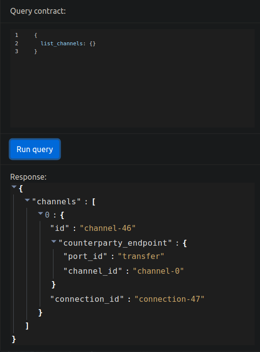
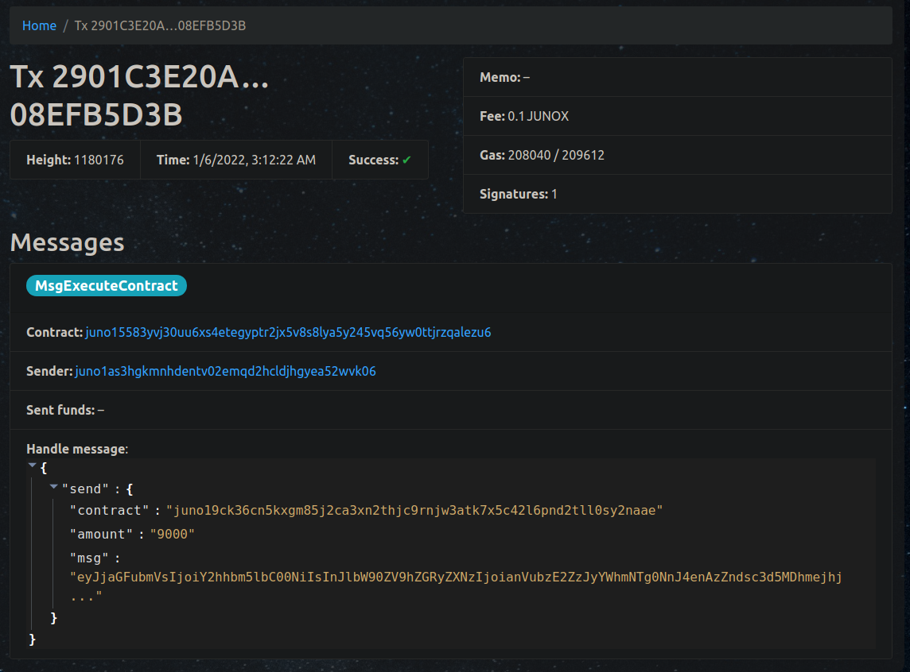
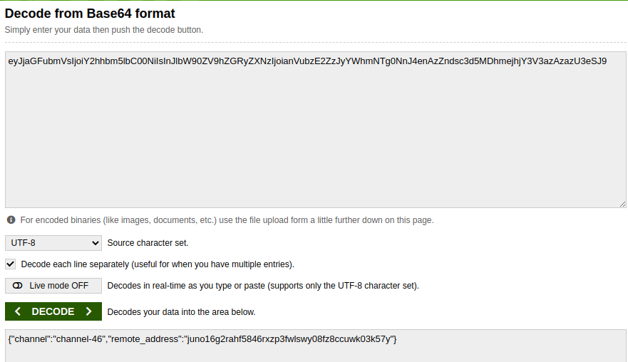
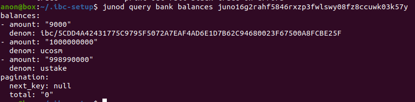

# CW20 IBC Tutorial

In this tutorial, we shall go through the steps needed to send a CW20 token over IBC from the `uni` Juno testnet to a local Juno testnet.

## Resources

- [ts-relayer](https://github.com/confio/ts-relayer)
- [Juno](https://github.com/CosmosContracts/juno)
- [docker](https://docs.docker.com/engine/install/)
- [docker-compose](https://docs.docker.com/compose/install/)
- [cw20-ics20](https://github.com/CosmWasm/cw-plus/tree/main/contracts/cw20-ics20)
- [Cosmwasm](https://docs.cosmwasm.com/docs/0.14/getting-started/installation/)
- [Juno Discord](https://discord.gg/V9nEY4Ca)
- [git](https://git-scm.com/book/en/v2/Getting-Started-Installing-Git)

## Setup

### Prerequisites 

Follow this [tutorial](https://docs.cosmwasm.com/docs/0.14/getting-started/installation/) to install Rust and CosmWasm.
Follow this [tutorial](https://docs.docker.com/engine/install/) to install docker.
Follow this [tutorial](https://docs.docker.com/compose/install/) to install docker-compose.
Follow this [tutorial](https://git-scm.com/book/en/v2/Getting-Started-Installing-Git) to install git.
Follow this [tutorial](https://docs.junonetwork.io/validators/getting-setup) to install junod.

### Juno uni testnet

You should have followed this [tutorial](https://docs.junonetwork.io/validators/getting-setup) and installed `junod`. At the time of writing this I am using `v2.1.0`. This can be retrieved by running `junod version`.

We want to create a new account and fund with some testnet tokens:

```
junod keys add testnetAccount
```

Save the address and the mnemonic phrase of this account. Now we go to the [Juno discord](https://discord.gg/V9nEY4Ca) and request funds for the account that you generated by going to the `#Faucet` channel and typing `$request YOUR_JUNO_ADDRESS_HERE` you should be able to see previous requests if there is confusion.

We can check if the account was funded by querying the bank module as such:

```
junod query bank balances YOUR_JUNO_ADDRESS_HERE --chain-id uni --node https://rpc.juno.giansalex.dev:443
```

The response should be something like this:

```
balances:
- amount: "4000000"
  denom: ujunox
pagination:
  next_key: null
  total: "0"
```

If the node RPC is down I suggest asking on discord for a public RPC or running a local uni testnet node.

### Juno node running a custom network

We will setup a Juno node on our own custom network, this will be the network that we will send the CW20 token to from the Juno uni testnet.

Clone the Juno repository by running the following commands in your terminal:

```
git clone https://github.com/CosmosContracts/juno.git
```

Enter the repository and start the local Juno node:

```
cd juno
docker-compose up
```

You now have a Juno blockchain running on a custom network(not connected to testnet or mainnet), you can see that it's up by visiting `http://localhost:26657/` on your browser and seeing a list of possible queries visible.

If you made no changes to the `.env` file, the testnet comes with a pre-funded address, who's mnemonic you can find here: https://github.com/CosmosContracts/juno/blob/main/docker/test-user.env. We can import this mnemonic phrase to our local junod client using the following commands:

```
junod keys add localNetAccount --recover
```

You should be prompted to enter the mnemonic phrase found in the above link, or your own if you've changed it. If this was done successfully you should have this prompt:

```
- name: localNetAccount
  type: local
  address: juno16g2rahf5846rxzp3fwlswy08fz8ccuwk03k57y
  pubkey: '{"@type":"/cosmos.crypto.secp256k1.PubKey","key":"A9C5c0m1DeTjKyKsba9mvXm/QwYACC+aLs+8q7RA7YCq"}'
  mnemonic: ""
```

We can check if this account was funded correctly at launch of your own custom network:


```
junod query bank balances juno16g2rahf5846rxzp3fwlswy08fz8ccuwk03k57y --chain-id testing --node http://127.0.0.1:26657
```

The response should be something like this:

```
balances:
- amount: "1000000000"
  denom: ucosm
- amount: "1000000000"
  denom: ustake
pagination:
  next_key: null
  total: "0"

```


### CW20-ICS20 Contract

**NOTE** The original code was taken from https://github.com/CosmWasm/cw-plus.git

Clone this directory https://github.com/VitalyVolozhinov/cw20-ics20.git using the following command:

```
git clone https://github.com/VitalyVolozhinov/cw20-ics20.git
```

Navigate to the CW20-ICS20 directory:

```
cd cw20-ics20
```

We then compile and optimize the contract using the following commands:

```
# Compile the contract
cargo wasm

# Strip all unused code out
RUSTFLAGS='-C link-arg=-s' cargo wasm

# Optimize the compiled code
docker run --rm -v "$(pwd)":/code \
  --mount type=volume,source="$(basename "$(pwd)")_cache",target=/code/target \
  --mount type=volume,source=registry_cache,target=/usr/local/cargo/registry \
  cosmwasm/rust-optimizer:0.12.4
```

A compiled result should have been created in the `artifacts` folder called `cw20_ics20.wasm`. We now want to store this contract on the Juno uni testnet blockchain and then instantiate it. While in the cw20-ics20 directory run the following command:

```
# Store the code on the blockchain
RES=$(junod tx wasm store artifacts/cw20_ics20.wasm --from testnetAccount -y --output json --chain-id uni --node https://rpc.juno.giansalex.dev:443 --gas auto --fees 208566ujunox)
```

You can echo the `$RES` to confirm the transaction was sent. If you have an error with the fee, adjust it accordingly and retry the above transaction. A successful transaction looks like this by running this command `echo $RES`:

```
{"height":"0","txhash":"103AD26AC46C77CDA674B0A160A521DA63A90775398B926369394BA8CF39579B","codespace":"","code":0,"data":"","raw_log":"[]","logs":[],"info":"","gas_wanted":"0","gas_used":"0","tx":null,"timestamp":"","events":[]}
```

Query the transaction to retrieve the CODE_ID:

```
junod query tx YOUR_TX_HASH_HERE --chain-id uni --node https://rpc.juno.giansalex.dev:443
```

The CODE_ID can be found in the `raw_log` part of the transaction:

```
raw_log: '[{"events":[{"type":"message","attributes":[{"key":"action","value":"/cosmwasm.wasm.v1.MsgStoreCode"},{"key":"module","value":"wasm"},{"key":"sender","value":"juno1as3hgkmnhdentv02emqd2hcldjhgyea52wvk06"}]},{"type":"store_code","attributes":[{"key":"code_id","value":"308"}]}]}]'
```

As you can see here `{"key":"code_id","value":"308"}`, `308` is the code ID for my contract. Yours will be higher as uploads are enumerated in sequential order. You can also replace the tx hash in this link with your own: `https://blueprints.juno.giansalex.dev/#/transactions/YOUR_TX_HASH_HERE` and browse it. 

We now want to instantiate the contract, creating our instance of the code uploaded above.(You may also use my uploaded 308 contract, instantiate it and use it as you need). Write the following command in your terminal to pass the `$INIT` instantiation parameters to the cosmwasm constructor fundction, to create a contract:

```
export INIT='{"default_timeout": 1200}'
junod tx wasm instantiate YOUR_CODE_ID_HERE "$INIT" --from testnetAccount --label "my cw20-ics20" -y --chain-id uni --node https://rpc.juno.giansalex.dev:443 --gas auto --fees 100000ujunox
```

The output should be something like this:

```
gas estimate: 176757
code: 0
codespace: ""
data: ""
events: []
gas_used: "0"
gas_wanted: "0"
height: "0"
info: ""
logs: []
raw_log: '[]'
timestamp: ""
tx: null
txhash: 7E08C02DC25AC4A2C8BEDF76E545CBDF05C7C0FC0793293672544831EE07BCA2
```

We can now query the transaction and return the address of the instantiated contract using the following command:

```
junod query tx YOUR_TX_HASH_HERE --chain-id uni --node https://rpc.juno.giansalex.dev:443
```

One can now see in the `raw_log` section, that key `_contract_address` has a value which our contract address. This can be seen in the snippet below:

```
raw_log: '[{"events":[{"type":"instantiate","attributes":[{"key":"_contract_address","value":"juno19ck36cn5kxgm85j2ca3xn2thjc9rnjw3atk7x5c42l6pnd2tll0sy2naae"},{"key":"code_id","value":"308"}]},{"type":"message","attributes":[{"key":"action","value":"/cosmwasm.wasm.v1.MsgInstantiateContract"},{"key":"module","value":"wasm"},{"key":"sender","value":"juno1as3hgkmnhdentv02emqd2hcldjhgyea52wvk06"}]}]}]'
```

From this we can see that the `_contract_address` is `juno19ck36cn5kxgm85j2ca3xn2thjc9rnjw3atk7x5c42l6pnd2tll0sy2naae`. We can now interact with this contract. We can query the list of channels that this contract is connected to using this command:

```
junod query wasm contract-state smart YOUR_CONTRACT_ADDRESS_HERE '{"list_channels": {}}' --chain-id uni --node https://rpc.juno.giansalex.dev:443
```

The response should be:

```
data:
  channels: []
```

The channel list is empty as we haven't set up a relayer yet. Please keep note of this newly deployed contract address.

### TS-Relayer

Follow this [tutorial](https://github.com/confio/ts-relayer) to install the `ts-relayer`. Once the relayer is installed, you should be able to run `ibc-setup --help` and have an output of possible commands. Run the following command to generate default configuration files which we will manually change: 

```
ibc-setup init --src oysternet --dest nyancat
```

This command will most likely produce an error but not to worry as it doesn't matter. Navigate to the `$HOME/.ibc-setup` folder.

```
cd ~/.ibc-setup
```

Once inside this folder using `ls` you should see two files `app.yaml` and `registry.yaml`. Edit the `app.yaml` file and change `oysternet` to `uni` and `nyancat` to `testing`. Take note of the mnemonic in app.yaml, which we'll then be importing into our junod client to find out its address and top it up. Run the following command, which will then prompt you to import the mnemonic:

```
junod keys add relayerAccount --recover
```

After entering the mnemonic phrase found in the `app.yaml` file and clicking enter, you should have successfully added the relayer account. Now we need to fund the account with some tokens to execute the transactions. This can be done with the following commands:

**NOTE** You can retrieve the relayerAccount address by doing the following command `junod keys list` and find the corresponding address to the `relayerAccount`
**NOTE** Ensure that the `testing` network previously setup using `docker-compose up` is still running by this point.

```
junod tx bank send localNetAccount RELAYER_ADDRESS_HERE 1000000ustake --chain-id testing --node http://localhost:26657/
```

Next we fund the same address but on the uni testnet:

```
junod tx bank send testnetAccount RELAYER_ADDRESS_HERE 1000000ujunox --chain-id uni --node https://rpc.juno.giansalex.dev:443 --gas auto --fees 5000ujunox
```
You can verify if transfers are successful using this command:

```
ibc-setup balances
```

Now open `registry.yaml` and delete the contents of the file and paste this data:

**NOTE** remember the contract we deployed and instantiated get it's address and paste it in the `ics20_port` value so it should look something like this: `wasm.juno19ck36cn5kxgm85j2ca3xn2thjc9rnjw3atk7x5c42l6pnd2tll0sy2naae` 

```
version: 1

chains:
  testing:
    chain_id: testing
    prefix: juno
    gas_price: 0.2ustake
    hd_path: m/44'/118'/0'/0/0
    ics20_port: 'transfer'
    rpc:
      - http://localhost:26657/
  uni:
    chain_id: uni
    prefix: juno
    gas_price: 0.1ujunox
    hd_path: m/44'/118'/0'/0/0
    ics20_port: 'wasm.YOUR_CONTRACT_HERE'
    rpc:
      - https://rpc.juno.giansalex.dev:443
```

Save and close the `registry.yaml` file. We can now create the `ics20` channel by running the following command:

```
ibc-setup ics20 -v
```

You should have a similar output to this:

```
Created channel:
  uni: wasm.juno19ck36cn5kxgm85j2ca3xn2thjc9rnjw3atk7x5c42l6pnd2tll0sy2naae/channel-46 (connection-47)
  testing: transfer/channel-0 (connection-0)
```

If you repeat the previous query you should have a different output, running the following command:

```
junod query wasm contract-state smart YOUR_CONTRACT_ADDRESS_HERE '{"list_channels": {}}' --chain-id uni --node https://rpc.juno.giansalex.dev:443
```

You should have the following output:

```
data:
  channels:
  - connection_id: connection-47
    counterparty_endpoint:
      channel_id: channel-0
      port_id: transfer
    id: channel-46
```

Congratulations on setting up a relayer connected to the CosmWasm Smart contract and the testnet Juno Blockchain.

### Instantiating a CW20 Token

There is already a CW20 token uploaded to the Juno uni testnet, we only need to instantiate it and mint tokens for our own custom token using their code. This can be done by executing the following commands:

```
export INIT='{"name": "BroCoin", "symbol":"BRO", "decimals": 6, "initial_balances": [{"address": "YOUR_ACCOUNT_ADDRESS_HERE", "amount": "10000000000000"}]}'
junod tx wasm instantiate 1 "$INIT" --from testnetAccount --label "BRO CW20" -y --chain-id uni --node https://rpc.juno.giansalex.dev:443 --gas auto --fees 100000ujunox
```

Take note of the successfully instantiated contract by querying the transaction the above command returned. The `raw_logs` should contain the contracts address.

## Executing Transfers

Our transfer of a CW20 token from source to destination chain will include sending tokens to our ICS20 contract, and in the msg parameter include a base64 encoded that executes the TransferMsg function of that contract. The below message includes a cw20 transfer of 9000 BRO tokens to our ics20 IBC contract. In this message, the msg parameter includes a base64 encoded json string that provides the json schema of the TransferMsg, which includes the IBC channel ID and remote_address. The remote_address is the address at which the IBC tokens will be received in the destination chain whilst the channel ID is the ID generated using our relayer, that connects to our ICS20 contract and the destination chain. 

Let's construct our transaction to transfer tokens across.

Firstly, we'll take a standard cw20 token transfer, which includes a transfer of 9000 BRO tokens through our CW20 token contract ``juno19ck36cn5kxgm85j2ca3xn2thjc9rnjw3atk7x5c42l6pnd2tll0sy2naae`:

```
{"send": {"contract": "juno19ck36cn5kxgm85j2ca3xn2thjc9rnjw3atk7x5c42l6pnd2tll0sy2naae", "amount": "9000","msg":""}}
```

Secondly, we want to insert in the msg parameter the execution that we require to take place when these tokens arrive at their first destination, our ICS20 contract. This is the TransferMsg execution path, which requires the following parameters:
```
{"channel":"<channel id>","remote_address":"<destination chain address>"}
```
In the channel ID, enter your relayer's newly created channel ID between source and destination chains, whilst in remote_address, add the address at which you want to receive the BRO tokens on the destination chain. Once these are filled in, go to https://www.base64encode.org/ and encode the string to base64.

For example, `{"channel":"channel-46","remote_address":"juno16g2rahf5846rxzp3fwlswy08fz8ccuwk03k57y"}` becomes `eyJjaGFubmVsIjoiY2hhbm5lbC00NiIsInJlbW90ZV9hZGRyZXNzIjoianVubzE2ZzJyYWhmNTg0NnJ4enAzZndsc3d5MDhmejhjY3V3azAzazU3eSJ9=`

Next, we'll use the above json strings to construct our transactions. Copy your base64 encoded string into the 'msg' parameter of the previous 'send' json string.

You can then go ahead and save this as an EXECUTE variable, so that it can be included in the following command:
```
export EXECUTE='{"send": {"contract": "juno19ck36cn5kxgm85j2ca3xn2thjc9rnjw3atk7x5c42l6pnd2tll0sy2naae", "amount": "9000","msg":"eyJjaGFubmVsIjoiY2hhbm5lbC00NiIsInJlbW90ZV9hZGRyZXNzIjoianVubzE2ZzJyYWhmNTg0NnJ4enAzZndsc3d5MDhmejhjY3V3azAzazU3eSJ9="}}'
```

We're at the final step! Go ahead and run the execute function on our CW20 contract, which will then execute another function on our ICS20 IBC contract.

```
junod tx wasm execute juno15583yvj30uu6xs4etegyptr2jx5v8s8lya5y245vq56yw0ttjrzqalezu6 "$EXECUTE" --gas auto --fees 100000ujunox --chain-id uni --node https://rpc.juno.giansalex.dev:443 --from testnetAccount
```

### Proof

#### Packet Relay Success


#### Querying for the list of connected channels

- https://blueprints.juno.giansalex.dev/#/contracts/juno19ck36cn5kxgm85j2ca3xn2thjc9rnjw3atk7x5c42l6pnd2tll0sy2naae



#### TX which sends BroCoin CW20 to the Cw20-ICS20 contract

- https://blueprints.juno.giansalex.dev/#/transactions/2901C3E20A1428F969E7E93C1BB32C39218C2392965B29F34B9D1B208EFB5D3B



#### Decoding the MSG inside the CW20 send

- https://www.base64decode.org/



- https://blueprints.juno.giansalex.dev/#/contracts/juno15583yvj30uu6xs4etegyptr2jx5v8s8lya5y245vq56yw0ttjrzqalezu6

#### Proof of receipt on target chain


